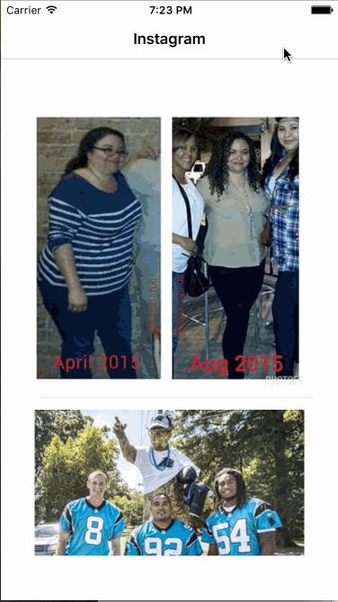

# Instagram

This exercise is to build a simple read-only Instagram client. The purpose of this exercise is to practice using table views, passing data between view controllers, and various navigation types in iOS.

Time spent: x hours

Completed:

* [] Required: 

GIF created with [LiceCap](http://www.cockos.com/licecap/).